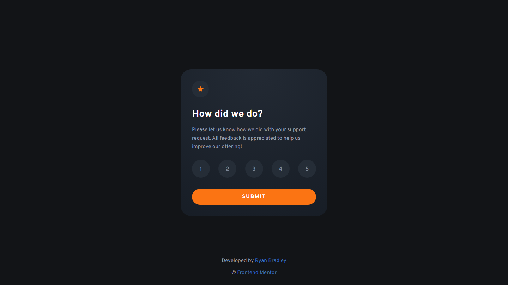

# Frontend Mentor - Interactive rating component solution

This is a solution to the [Interactive rating component challenge on Frontend Mentor](https://www.frontendmentor.io/challenges/interactive-rating-component-koxpeBUmI). Frontend Mentor challenges help you improve your coding skills by building realistic projects. 

## Table of contents

- [Overview](#overview)
  - [The challenge](#the-challenge)
  - [Screenshot](#screenshot)
  - [Links](#links)
- [My process](#my-process)
  - [Built with](#built-with)
  - [What I learned](#what-i-learned)
  - [Continued development](#continued-development)
- [Author](#author)

## Overview

### The challenge

Users should be able to:

- View the optimal layout for the app depending on their device's screen size
- See hover states for all interactive elements on the page
- Select and submit a number rating
- See the "Thank you" card state after submitting a rating

### Screenshot

### Links

- Solution URL: [GitHub Repo](https://github.com/ryanbradley-webdev/interactive-rating-component)
- Live Site URL: [Interactive Rating Component](https://interactive-rating-component-rbwd.netlify.app/)

## My process

### Built with

- [React](https://reactjs.org/) - JS library

### What I learned

I had some issues centering text in buttons due to the inherent line-heights with fonts. I was able to center the texts by placing them in spans within the buttons and positioning them absolutely within the buttons. I'm not confident that this is the ideal solution, however it is functional and stays centered in every screen size.

### Continued development

This type of rating submission is a very unique one, and I intend to incorporate this system in future production projects.

## Author

- Portfolio - [ryanbradleyportfolio.com](https://ryanbradleyportfolio.com)
- Frontend Mentor - [@ryanbradley-webdev](https://www.frontendmentor.io/profile/ryanbradley-webdev)
- Instagram - [@ryanbradley_web_dev](https://www.instagram.com/ryanbradley_web_dev/)
